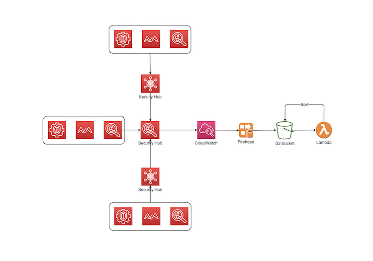
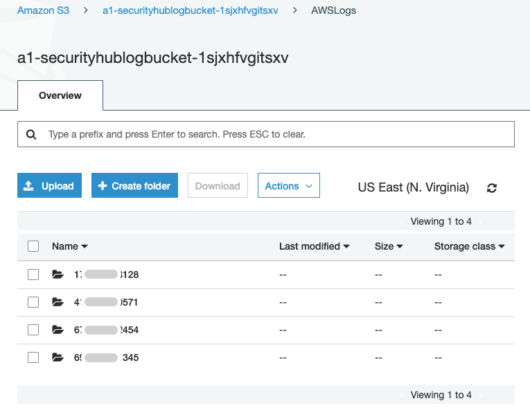
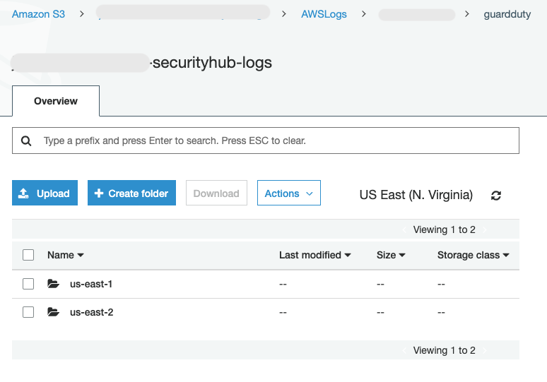

# Export Security Hub Findings to S3 Bucket

This solution exports Security Hub Findings to a S3 bucket.  We use a CloudWatch Event Rule to forward all Security Hub events to a Kinesis Firehose Data Stream, then a S3 bucket.  We use a Lambda function to store findings in the AWSLogs/AWS_account_id/security_hub_integrrated_product_name/region/yyyy/mm/dd structure.  This hierarchy allows easy Finding consumption by a downstream system.

This architecture is depicted in the diagram below:

A good use case of this solution is to deploy this solution to the AWS account that hosts the Security Hub master.  All findings from member accounts of the Security Hub master are exported and partitioned by account. 

Findings in a multi-account and multi-region AWS Organization such as Control Tower can be exported to a centralized Log Archive account using this solution.  However, you must modify this solution to store exported findings in a centralized s3 bucket

## Prerequisites

Python 3.7 or higher.

## Deployment
Download and deploy the securityhub_export.yml CloudFormation template.

## Validation
Upon successful deployment, you should see findings from different accounts.

You should see findings from multiple products.

Below is an example of aggregating findings from multiple regions.

## Tested Use Cases
- AWS native security services - GuardDuty, Access Analyzer
- Security Hub standards - CIS benchmark, PCI/DSS, AWS Security best practices
- Third party integrations - Cloud Custodian
- Multi-region findings - us-east-1, us-east-2, us-west-1, eu-west-1